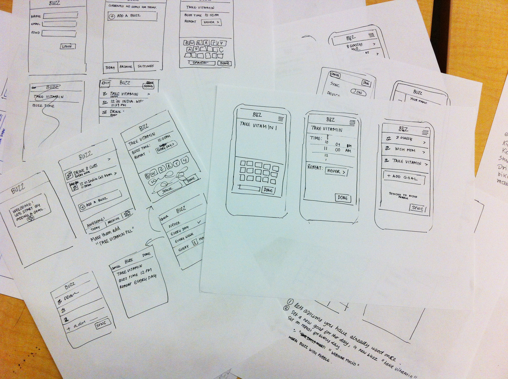

import Bleed from 'nextra-theme-docs/bleed'

# Prototyping

Prototyping...lets talk about it, some of us hate it and wish our ideas would just jump out of our head and onto the screen. Some of us love it and view every prototype as a chance to tell a story.

I'm going to spend the next few minutes trying my best to get you onboard with the second line of thought.

## What is a Prototype?

This is a prototype:

#### Insert image of paper prototype
<Bleed></Bleed>

This is also a prototype:

#### Insert image of fleshed out figma prototype

In short, prototypes tell a story. When you're planning to build complex UI...or anything for that matter. A prototype allows you to elimate telling what your design will do and focus more on showing. 

As UXers, Product Designers, Makers or whatever our choose to call yourself. We prototype at varying fidelities based on self needs or business needs. Whether you need to pitch an idea to get funding, provide specs for your Front End Engineering team or simply get feedback and validation on an early stage idea. It's alot easier to prove yourself with a prototype on a big screen. 

